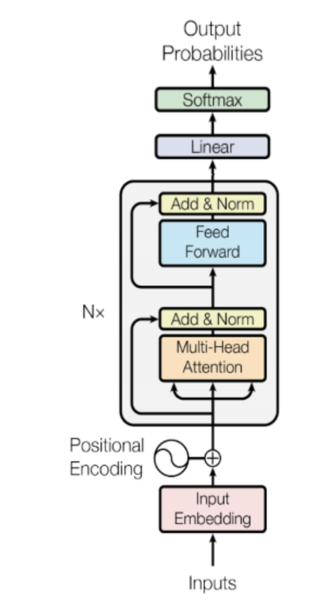

# Assignment 2: Transformer Summarizer

Welcome to the second assignment of course 4. In this assignment you will explore summarization using the transformer model. Yes, you will implement the transformer decoder from scratch, but we will slowly walk you through it. There are many hints in this notebook so feel free to use them as needed. 


## Important Note on Submission to the AutoGrader

Before submitting your assignment to the AutoGrader, please make sure you are not doing the following:

1. You have not added any _extra_ `print` statement(s) in the assignment.
2. You have not added any _extra_ code cell(s) in the assignment.
3. You have not changed any of the function parameters.
4. You are not using any global variables inside your graded exercises. Unless specifically instructed to do so, please refrain from it and use the local variables instead.
5. You are not changing the assignment code where it is not required, like creating _extra_ variables.

If you do any of the following, you will get something like, `Grader not found` (or similarly unexpected) error upon submitting your assignment. Before asking for help/debugging the errors in your assignment, check for these first. If this is the case, and you don't remember the changes you have made, you can get a fresh copy of the assignment by following these [instructions](https://www.coursera.org/learn/attention-models-in-nlp/supplement/shBOS/how-to-refresh-your-workspace).

## Outline

- [Introduction](#0)
- [Part 1: Importing the dataset](#1)
    - [1.1 Encode & Decode helper functions](#1.1)
    - [1.2 Defining parameters](#1.2)
    - [1.3 Exploring the data](#1.3)
- [Part 2: Summarization with transformer](#2)
    - [2.1 Dot product attention](#2.1)
        - [Exercise 01](#ex01)
    - [2.2 Causal Attention](#2.2)
        - [Exercise 02](#ex02)
    - [2.3 Transformer decoder block](#2.3)
        - [Exercise 03](#ex03)
    - [2.4 Transformer Language model](#2.4)
        - [Exercise 04](#ex04)
- [Part 3: Training](#3)
    - [3.1 Training the model](#3.1)
        - [Exercise 05](#ex05)
- [Part 4: Evaluation](#4)
    - [4.1 Loading in a trained model](#4.1)
- [Part 5: Testing with your own input](#5) 
    - [Exercise 6](#ex06)
    - [5.1 Greedy decoding](#5.1)
        - [Exercise 07](#ex07)

<a name='0'></a>
### Introduction

Summarization is an important task in natural language processing and could be useful for a consumer enterprise. For example, bots can be used to scrape articles, summarize them, and then you can use sentiment analysis to identify the sentiment about certain stocks. Anyways who wants to read an article or a long email today, when you can build a transformer to summarize text for you. Let's get started, by completing this assignment you will learn to:  

- Use built-in functions to preprocess your data
- Implement DotProductAttention
- Implement Causal Attention
- Understand how attention works
- Build the transformer model
- Evaluate your model
- Summarize an article

As you can tell, this model is slightly different than the ones you have already implemented. This is heavily based on attention and does not rely on sequences, which allows for parallel computing. 


```python
import sys
import os
import w2_tests
import numpy as np

import textwrap
wrapper = textwrap.TextWrapper(width=70)

import trax
from trax import layers as tl
from trax.fastmath import numpy as jnp

# to print the entire np array
np.set_printoptions(threshold=sys.maxsize)
```


```python
!pip list|grep trax
```

    trax                         1.3.9
    WARNING: You are using pip version 21.2.4; however, version 22.0.4 is available.
    You should consider upgrading via the '/opt/conda/bin/python3 -m pip install --upgrade pip' command.


<a name='1'></a>
## Part 1: Importing the dataset

Trax makes it easy to work with Tensorflow's datasets:


```python
# This will download the dataset if no data_dir is specified.
# Downloading and processing can take bit of time,
# so we have the data already in 'data/' for you

# Importing CNN/DailyMail articles dataset
train_stream_fn = trax.data.TFDS('cnn_dailymail',
                                 data_dir='data/',
                                 keys=('article', 'highlights'),
                                 train=True)

# This should be much faster as the data is downloaded already.
eval_stream_fn = trax.data.TFDS('cnn_dailymail',
                                data_dir='data/',
                                keys=('article', 'highlights'),
                                train=False)
```

    WARNING:absl:No GPU/TPU found, falling back to CPU. (Set TF_CPP_MIN_LOG_LEVEL=0 and rerun for more info.)


    WARNING:tensorflow:AutoGraph could not transform <function TFDS.<locals>.select_from at 0x7f2f7e4f3200> and will run it as-is.
    Please report this to the TensorFlow team. When filing the bug, set the verbosity to 10 (on Linux, `export AUTOGRAPH_VERBOSITY=10`) and attach the full output.
    Cause: module 'gast' has no attribute 'Constant'
    To silence this warning, decorate the function with @tf.autograph.experimental.do_not_convert


    WARNING:tensorflow:AutoGraph could not transform <function TFDS.<locals>.select_from at 0x7f2f7e4f3200> and will run it as-is.
    Please report this to the TensorFlow team. When filing the bug, set the verbosity to 10 (on Linux, `export AUTOGRAPH_VERBOSITY=10`) and attach the full output.
    Cause: module 'gast' has no attribute 'Constant'
    To silence this warning, decorate the function with @tf.autograph.experimental.do_not_convert


    WARNING: AutoGraph could not transform <function TFDS.<locals>.select_from at 0x7f2f7e4f3200> and will run it as-is.
    Please report this to the TensorFlow team. When filing the bug, set the verbosity to 10 (on Linux, `export AUTOGRAPH_VERBOSITY=10`) and attach the full output.
    Cause: module 'gast' has no attribute 'Constant'
    To silence this warning, decorate the function with @tf.autograph.experimental.do_not_convert
    WARNING:tensorflow:AutoGraph could not transform <function TFDS.<locals>.select_from at 0x7f2f7f2facb0> and will run it as-is.
    Please report this to the TensorFlow team. When filing the bug, set the verbosity to 10 (on Linux, `export AUTOGRAPH_VERBOSITY=10`) and attach the full output.
    Cause: module 'gast' has no attribute 'Constant'
    To silence this warning, decorate the function with @tf.autograph.experimental.do_not_convert


    WARNING:tensorflow:AutoGraph could not transform <function TFDS.<locals>.select_from at 0x7f2f7f2facb0> and will run it as-is.
    Please report this to the TensorFlow team. When filing the bug, set the verbosity to 10 (on Linux, `export AUTOGRAPH_VERBOSITY=10`) and attach the full output.
    Cause: module 'gast' has no attribute 'Constant'
    To silence this warning, decorate the function with @tf.autograph.experimental.do_not_convert


    WARNING: AutoGraph could not transform <function TFDS.<locals>.select_from at 0x7f2f7f2facb0> and will run it as-is.
    Please report this to the TensorFlow team. When filing the bug, set the verbosity to 10 (on Linux, `export AUTOGRAPH_VERBOSITY=10`) and attach the full output.
    Cause: module 'gast' has no attribute 'Constant'
    To silence this warning, decorate the function with @tf.autograph.experimental.do_not_convert


<a name='1.1'></a>
## 1.1 Tokenize & Detokenize helper functions

Just like in the previous assignment, the cell above loads in the encoder for you. Given any data set, you have to be able to map words to their indices, and indices to their words. The inputs and outputs to your [Trax](https://github.com/google/trax) models are usually tensors of numbers where each number corresponds to a word. If you were to process your data manually, you would have to make use of the following: 

- <span style='color:blue'> word2Ind: </span> a dictionary mapping the word to its index.
- <span style='color:blue'> ind2Word:</span> a dictionary mapping the index to its word.
- <span style='color:blue'> word2Count:</span> a dictionary mapping the word to the number of times it appears. 
- <span style='color:blue'> num_words:</span> total number of words that have appeared. 

Since you have already implemented these in previous assignments of the specialization, we will provide you with helper functions that will do this for you. Run the cell below to get the following functions:

- <span style='color:blue'> tokenize: </span> converts a text sentence to its corresponding token list (i.e. list of indices). Also converts words to subwords.
- <span style='color:blue'> detokenize: </span> converts a token list to its corresponding sentence (i.e. string).


```python
def tokenize(input_str, EOS=1):
    """Input str to features dict, ready for inference"""
  
    # Use the trax.data.tokenize method. It takes streams and returns streams,
    # we get around it by making a 1-element stream with `iter`.
    inputs =  next(trax.data.tokenize(iter([input_str]),
                                      vocab_dir='vocab_dir/',
                                      vocab_file='summarize32k.subword.subwords'))
    
    # Mark the end of the sentence with EOS
    return list(inputs) + [EOS]

def detokenize(integers):
    """List of ints to str"""
  
    s = trax.data.detokenize(integers,
                             vocab_dir='vocab_dir/',
                             vocab_file='summarize32k.subword.subwords')
    
    return wrapper.fill(s)
```

<a name='1.2'></a>

## 1.2 Preprocessing for Language Models: Concatenate It!

This week you will use a language model -- Transformer Decoder -- to solve
an input-output problem. As you know, language models only predict the next
word, they have no notion of inputs. To create a single input suitable for
a language model, we concatenate inputs with targets putting a separator
in between. We also need to create a mask -- with 0s at inputs and 1s at targets -- so that the model is not penalized for mis-predicting the article and only focuses on the summary. See the preprocess function below for how this is done.


```python
# Special tokens
SEP = 0 # Padding or separator token
EOS = 1 # End of sentence token

# Concatenate tokenized inputs and targets using 0 as separator.
def preprocess(stream):
    for (article, summary) in stream:
        joint = np.array(list(article) + [EOS, SEP] + list(summary) + [EOS])
        mask = [0] * (len(list(article)) + 2) + [1] * (len(list(summary)) + 1) # Accounting for EOS and SEP
        yield joint, joint, np.array(mask)

# You can combine a few data preprocessing steps into a pipeline like this.
input_pipeline = trax.data.Serial(
    # Tokenizes
    trax.data.Tokenize(vocab_dir='vocab_dir/',
                       vocab_file='summarize32k.subword.subwords'),
    # Uses function defined above
    preprocess,
    # Filters out examples longer than 2048
    trax.data.FilterByLength(2048)
)

# Apply preprocessing to data streams.
train_stream = input_pipeline(train_stream_fn())
eval_stream = input_pipeline(eval_stream_fn())

train_input, train_target, train_mask = next(train_stream)
assert sum((train_input - train_target)**2) == 0  # They are the same in Language Model (LM).
```


```python
# prints mask, 0s on article, 1s on summary
print(f'Single example mask:\n\n {train_mask}')
```

    Single example mask:
    
     [0 0 0 0 0 0 0 0 0 0 0 0 0 0 0 0 0 0 0 0 0 0 0 0 0 0 0 0 0 0 0 0 0 0 0 0 0
     0 0 0 0 0 0 0 0 0 0 0 0 0 0 0 0 0 0 0 0 0 0 0 0 0 0 0 0 0 0 0 0 0 0 0 0 0
     0 0 0 0 0 0 0 0 0 0 0 0 0 0 0 0 0 0 0 0 0 0 0 0 0 0 0 0 0 0 0 0 0 0 0 0 0
     0 0 0 0 0 0 0 0 0 0 0 0 0 0 0 0 0 0 0 0 0 0 0 0 0 0 0 0 0 0 0 0 0 0 0 0 0
     0 0 0 0 0 0 0 0 0 0 0 0 0 0 0 0 0 0 0 0 0 0 0 0 0 0 0 0 0 0 0 0 0 0 0 0 0
     0 0 0 0 0 0 0 0 0 0 0 0 0 0 0 0 0 0 0 0 0 0 0 0 0 0 0 0 0 0 0 0 0 0 0 0 0
     0 0 0 0 0 0 0 0 0 0 0 0 0 0 0 0 0 0 0 0 0 0 0 0 0 0 0 0 0 0 0 0 0 0 0 0 0
     0 0 0 0 0 0 0 1 1 1 1 1 1 1 1 1 1 1 1 1 1 1 1 1 1 1 1 1 1 1 1 1 1 1 1 1 1
     1 1 1 1 1 1 1 1 1 1 1 1 1 1 1 1 1 1 1 1 1 1 1]


```python
# prints: [Example][<EOS>][<pad>][Example Summary][<EOS>]
print(f'Single example:\n\n {detokenize(train_input)}')
```

    Single example:
    
     By . Associated Press . PUBLISHED: . 14:11 EST, 25 October 2013 . | .
    UPDATED: . 15:36 EST, 25 October 2013 . The bishop of the Fargo
    Catholic Diocese in North Dakota has exposed potentially hundreds of
    church members in Fargo, Grand Forks and Jamestown to the hepatitis A
    virus in late September and early October. The state Health Department
    has issued an advisory of exposure for anyone who attended five
    churches and took communion. Bishop John Folda (pictured) of the Fargo
    Catholic Diocese in North Dakota has exposed potentially hundreds of
    church members in Fargo, Grand Forks and Jamestown to the hepatitis A
    . State Immunization Program Manager Molly Howell says the risk is
    low, but officials feel it's important to alert people to the possible
    exposure. The diocese announced on Monday that Bishop John Folda is
    taking time off after being diagnosed with hepatitis A. The diocese
    says he contracted the infection through contaminated food while
    attending a conference for newly ordained bishops in Italy last month.
    Symptoms of hepatitis A include fever, tiredness, loss of appetite,
    nausea and abdominal discomfort. Fargo Catholic Diocese in North
    Dakota (pictured) is where the bishop is located .<EOS><pad>BishopJohn
    Folda, of North Dakota, is taking time off after being diagnosed . He
    contracted the infection through contaminated food in Italy . Church
    members in Fargo, Grand Forks and Jamestown could have been exposed
    .<EOS>


<a name='1.3'></a>

## 1.3 Batching with bucketing

As in the previous week, we use bucketing to create batches of data.


```python
# Bucketing to create batched generators.

# Buckets are defined in terms of boundaries and batch sizes.
# Batch_sizes[i] determines the batch size for items with length < boundaries[i]
# So below, we'll take a batch of 16 sentences of length < 128 , 8 of length < 256,
# 4 of length < 512. And so on. 
boundaries =  [128, 256,  512, 1024]
batch_sizes = [16,    8,    4,    2, 1]

# Create the streams.
train_batch_stream = trax.data.BucketByLength(
    boundaries, batch_sizes)(train_stream)

eval_batch_stream = trax.data.BucketByLength(
    boundaries, batch_sizes)(eval_stream)
```


```python
# Every execution will result in generation of a different article
# Try running this cell multiple times to see how the length of the examples affects the batch size
input_batch, _, mask_batch = next(train_batch_stream)

# Shape of the input_batch
input_batch.shape
```


    (1, 1188)


```python
# print corresponding integer values
print(input_batch[0])
```

    [  567   379  2475 18217  1362   379  7226  5182  3047  6611   136  4601
         3  3009   180  2937 16958     4     2   271   493   429 11969 28081
       379  9720 22449  3590  4601     3  3081   180  2255 16958     4     2
       381   493   429   379   512 10902  2077  1987   213 20959   103  1063
      1023   602   229 11565   186 11565   320   423    97   390     3   200
       412    97  2201  5632     2    36 15846 15555     4  1622   233    28
       602    90   749   103  1353   217   320 14909     4   188   192    41
        25  5764   145   261   563   672     3  1369    86   285     2   103
     10316  1019    28   585   527  1381    91   527   792   353    41   148
       710   132   421     2    22  2134  3923   186   131  2134  3685     2
       210   141   150   390   527    36   297     3   791    55  5330    11
      7136   186  2357  9218  6292    78   119  2006     7     5  1230  4048
       192  7136   379  1353    78  1777     6  1807  1377  1838   213  1208
     20199     4  4285   186  5791  1042  1019   379   213   382  1381    91
       379   200     2   412  4797   412    31  1018    40  2453   132   177
         2   132   583   103  1353  2685   320   616    61    50  2448   186
        94 10606 20781  5258     3   392  7136   186  2357  9218    40  1391
      9060  2704    41    40  1893  3997   602  2201     2 20955  1387     2
      1712   186 18537    14     7     5  4374  1838   193    54     3  1715
     16222     2   633  2702 24778   186     2    23   576   105   365   320
       213 16611    14 19457   344   968   480     3    34    36 12382   816
        78 14644     7     5   344     2  7136  4659  3611   267  1435   213
        94  3583     2 19777 12913     4     2 19120     2 10755     2 11575
       217 14400   391 10151    16     2 10151   217     2 18446     2 11317
       186 10509 18955  1348   938   285    23   379   545  1449  1782 18612
         4     2   413    28   445  4426   186   953   156 13975   318   132
       379   109  6610   862 14050     2    38    97 10509   911     2   166
        41  1435  2482  1019   379    33     2   130 18955  1348  2002     9
      2789  1113    28   451   527  4797   186 13433   602  2201   320    36
       297   799   261   563   672   379     9  3362   907   527  3997  2201
         2 20955  1387     2  1712   186 18537    14     7     5  4374  1353
      8930   132    28  8401 16872   379     9  1622     2  1779  2099   213
       164  7588     2  1893   213  6011 11241  5352   463  1599    28  8401
     16872   132    31   278   132 17108   587     2   415 10096     3 17895
      2685   213  2201     2 20392   619  5280     2   213   344     7     5
      1798     2   127  3611  4810  8485  1353    28   608   602   488     3
       397  5485   156  2685   213   379  2201  1353   213 18168 10363  8949
        16   527 16781   467    31  2188  1782   207   379  5632    72   101
      1779    40  9088  3140   209   132   602    70   186   285   602 12453
       379   188    44 11006  4203   114   192    41    25  2025  4189   691
       489  2002  7136   186  2357  9218  6292    78   119  2006     7     5
      1230   132  4048   192    22  1353    78  1777     6  1807  1377  1838
       213  1208 20199     4  4285     3    69    40 19204    17  1019   213
      1127   132  5686  1786   523    46  1653   379   412    28   941  5486
       691 18762    47 17684   186   823   132  5005 14400   391   572     2
      7646     2  3457 15383    47   186   928     3   642    97   489     6
     21561   379   628    22  1113   213 24036     6 12222  1183 20955  1387
       320    15   938  1779  1353   379 12829  5973 17277 21303     4   179
       278     3   392   213   489 14400   391  2357  1526    78    68   126
       412    28 13684   192  7136   345    28 12316     4   379   132   213
       644 10096 22762   352     2   171  4207   320   213   586   527 11741
      3199  9400    58     3   863    31   209  1056   213 17123 22527    21
      2789   601    61    28   323   228   527    72  7857     2   290 14388
         2   186   290   258     6 14388   186   103  1353 16222  1779  2704
       213  2201   379  5301   213    94  1348     6 14834 19613   113  6839
        25   753  7511  7136     7     5  1377  1353 19715     3    69   465
      3611    13     7    75   139 12844   130 10755     2    13    49     7
        26   211   278     3   449     7     5    38    13   630  1019 14400
       391   278   186    33     3    34   297  5511    22  6469  3611   129
       148  1006   213   164  7511    13    18   320   955  1838  1377     3
        13    18   320   245    28   379  2300  1358   527  2883   181    13
        62   369   413   179  1782    13  7739   320   172   213   179   379
       527    33   412   130  2137   181  1973 20687     5    64   166    13
       288   103    39  1151  1492   379   171    13   284  2524    78    33
       457     3    52     7     5  9513  7511    51    18   320   160    70
       403   379 26027  1019   911  2002 10703    16    28  4437   527 26988
         2  7136  4659   457   320 19346     4    15   938     7     5  5875
       132   213  7815  3611 18612     4     2    92  1106  2754    33   362
         2    13   234   476   285    33  1435    28   227 19370 11969   519
        90   953     7     5    19    18    28   325  2618     3   267   288
        13  2657   285   592    13   143   379    18  7485   246   320    36
       527   109  6873 10014  2002  2357     7     5  2178   229    44  1047
         2   412   131  1353  1893   132   213  2228  2685  4872    68  2136
      1353   320   923   726  1302    28  3443     3    34   213  2201   131
       206  1927   131  5155  2685   213   278   979     2 17907  8384     2
       186 20219   155   213  7815  1253   192 18853  2756    78   213   548
       826   542    31   414     3  2087    28   325  2298   527  1541    25
       576   320 16611    45 19457   344  1019 16330   186   213   228  1435
      2872   213  1272  3443   192    41  4609  2754   320   124  1248   105
       379   639   213  2201  5632    28   621  2685   213  1622     7     5
       792     2   213   489   186    31  6917 19085   320    36   297     2
        86    28   325  2298    25   576   365   320   213   344     7     5
     16330   132   438 10449     3     9  1272  1435   144  1893    28  3443
       192   213   228     2   133    61   527   213  1622     7     5    72
      7857     2   290 14388   186   290   258     6 14388     2  4609  2754
       320   124  1248   105     3    34   163  2264  1248   213  1681 25879
       181     2   633 24778   186  2441   285  1079   213   250   527    31
      1056   213  2789  7157  2685    19 13634   320   273    78   341   193
        54     3    69   127   285   213   228    25 21539    17   132    31
      8075   575   691   213   742   285     2   132   213   250     2  2357
        40    86    40   320 14909     4   150   390   341    68 10755    54
       605     3  7136   710 10641   914    78   611  4127     2   421     2
       186  2357    78   611  6922    10     1     0  7136   186  2357  9218
      1042   132  4048   192    22  1353    78  1377 16346 27439  6774  1628
       207 21091  2158 13433   602  2201   799   213   489 16346 27439  6774
      1628     9   907   527  3997  2201  1353   233   691    31   228   132
        28  8401 16872 16346 27439  6774  1628     9  2789     2  1779  2099
        28  7588     2   148   710   132   421   141   150   390  4189   523
       127    41   143    19  5947   320  1151   341    36   297  2104     1]


Things to notice:
 - First we see the corresponding values of the words.
 - The first 1, which represents the `<EOS>` tag of the article.
 - Followed by a 0, which represents a `<pad>` tag.
 - After the first 0 (`<pad>` tag) the corresponding values are of the words that are used for the summary of the article.
 - The second 1 represents the `<EOS>` tag for the summary.
 - All the trailing 0s represent `<pad>` tags which are appended to maintain consistent length (If you don't see them then it would mean it is already of max length)
 


```python
# print the article and its summary
print('Article:\n\n', detokenize(input_batch[0]))
```

    Article:
    
     By . Chris Pleasance . PUBLISHED: . 08:09 EST, 15 September 2013 . | .
    UPDATED: . 06:05 EST, 16 September 2013 . With divorce fast becoming
    the norm it seems true love is harder and harder to find these days.
    But as these letters reveal, one smitten couple found a love so strong
    it was able to endure even while they were separated during World War
    II. Not only that, it lasted for a total of 70 years of marriage until
    they both died in 2011, he aged 96 and she aged 92, within just three
    days of one another. How time passes: Frederick and Elizabeth Noble
    wed on New Year's Day 1941 while Frederick . was on 48-hour leave from
    the Royal Tank Corps and stayed married for . the next 70 years . But,
    as remarkable as their relationship had seemed in life, in death it
    was about to give up its biggest and most heartwarming surprise. After
    Frederick and Elizabeth Noble had passed relatives discovered they had
    kept 250 love letters, telegrams, notes and Valentine's cards from
    each other. Their grandson, Dr Andrew Rowland, has taken them along to
    the Antique Roadshow TV program. In one extract read on tonight's
    show, Frederick writes: 'You are the most wonderful, marvellous,
    precious, beloved, lovable, . adoring, adorable, charming, divine and
    loving sweetheart wife that has . ever lived. 'Darling, come a little
    closer and let me whisper in . your darling ears, all these loving
    words, because they are meant for . you, my sweetheart.' The pair
    wrote a series of remarkable and passionate love letters to one
    another throughout World War II . The amazing collection of 250
    letters, telegrams, notes and Valentine's cards was stored in a tea
    chest . The couple, who shared the same birthday, kept the memories
    stashed away inside a tea chest in their home in Wingate, County
    Durham. Speaking about the letters, Fiona Bruce, the show's host,
    said: 'Theirs was a real love story. What struck me about the .
    letters was the sheer outpouring of emotion across their pages. 'They
    . reveal two people who had fallen headlong in love - and that love
    burned . even more brightly while they were forced apart by war.'
    Frederick and Elizabeth Noble wed on New Year's Day in 1941 while he
    was on 48-hour leave from the Royal Tank Corps. He had volunteered for
    the Army in 1936 despite having been selected . as a professional
    footballer by Aston Villa and served in Afghanistan, . India, Burma,
    Ceylon and France. From these war-torn . countries he wrote the tear-
    jerking telegrams to his wife who was . nursing injured servicemen
    back home. After the war, . Elizabeth carried on her work as a nurse
    while Frederick became a miner . in the East Durham coalfield, before
    rising to the position of colliery overseer. During their long lives
    the besotted pair built up a large family of two daughters, four
    grandchildren, and four great-grandchildren and it was grandson who
    discovered the letters . Perhaps the most heart-wrenching messages
    were written when Frederick's leave was cancelled. He says: 'I'm very
    sorry my beloved, I can't get home. That's all I live for, . home and
    you. In another passage he adds: 'We both feel the same when I have to
    return from leave. I have to take a . firm hold of myself or I would
    never come back. 'I hate to see the back . of you as my bus or train
    pulls out because I know it will be weeks . before I set eyes on you
    again. It's terrible when we have to part - too . awful for words.'
    Showing a touch of humour, Frederick writes again to compliment his
    wife's skill in the kitchen: 'Darling, no matter what you think, I
    still say that you are a good cook . - so let's not have a small row.
    You know I wish that today I could . have sat down to one of your
    dinners.' Elizabeth's communication is more limited, as she was kept
    in the dark about where her husband was to keep military operations a
    secret. In the letters she did write she talks about the home front,
    rationing, and hiding under the kitchen table while bombs fell on the
    main road near their house. Only a small selection of letter were
    taken to Antiques Roadshow for filming and the family are keeping the
    rest secret while they decide what to do with them . While the letters
    reveal a lot about the couple's marriage, the war and their incredible
    devotion to one another, only a small selection were taken along to
    the show's filming in North Yorkshire. The rest are being kept a
    secret while the family, made up of the couple's two daughters, four
    grandchildren and four great-grandchildren, decide what to do with
    them. In an interview with the Sunday Mirror, Dr Rowland revealed that
    towards the end of their lives the pair talked about not wanting to go
    on without each other. He said that the family were comforted in their
    sadness by the thought that, in the end, Elizabeth had only had to
    endure three days without her beloved other half. Frederick died
    peacefully on December 4th, 2011, and Elizabeth on December
    7th.<EOS><pad>Frederickand Elizabeth Noble married in 1941 while he
    was on leave . They swapped passionate love letters throughout the war
    . The collection of 250 letters was found by their family in a tea
    chest . The pair, who shared a birthday, both died in 2011 just three
    days apart having said they could not bear to be without one another
    .<EOS>


You can see that the data has the following structure:
- <span style='color:blue'> [Article] </span> -> `<EOS>` -> `<pad>` -> <span style='color:blue'> [Article Summary] </span> -> `<EOS>` -> (possibly) multiple `<pad>`

The loss is taken only on the summary using cross_entropy as loss function. 

<a name='2'></a>
# Part 2: Summarization with transformer

Now that we have given you the data generator and have handled the preprocessing for you, it is time for you to build your own model. We saved you some time because we know you have already preprocessed data before in this specialization, so we would rather you spend your time doing the next steps. 

You will be implementing the attention from scratch and then using it in your transformer model. Concretely, you will understand how attention works, how you use it to connect the encoder and the decoder.


<a name='2.1'></a>
## 2.1 Dot product attention 

Now you will implement dot product attention which takes in a query, key, value, and a mask. It returns the output. 


Here are some helper functions that will help you create tensors and display useful information:
   - `create_tensor`  creates a `jax numpy array` from a list of lists.
   - `display_tensor` prints out the shape and the actual tensor.


```python
def create_tensor(t):
    """Create tensor from list of lists"""
    return jnp.array(t)


def display_tensor(t, name):
    """Display shape and tensor"""
    print(f'{name} shape: {t.shape}\n')
    print(f'{t}\n')
```

Before implementing it yourself, you can play around with a toy example of `dot product attention` without the softmax  operation. Technically it would not be `dot product attention` without the softmax but this is done to avoid giving away too much of the answer and the idea is to display these tensors to give you a sense of how they look like.

The formula for attention is this one:

$$
\text { Attention }(Q, K, V)=\operatorname{softmax}\left(\frac{Q K^{T}}{\sqrt{d_{k}}}+{M}\right) V\tag{1}\
$$

$d_{k}$ stands for the dimension of queries and keys.

The `query`, `key`, `value` and `mask` vectors are provided for this example.

Notice that the masking is done using very negative values that will yield a similar effect to using $-\infty $. 


```python
q = create_tensor([[1, 0, 0], [0, 1, 0]])
display_tensor(q, 'query')
k = create_tensor([[1, 2, 3], [4, 5, 6]])
display_tensor(k, 'key')
v = create_tensor([[0, 1, 0], [1, 0, 1]])
display_tensor(v, 'value')
m = create_tensor([[0, 0], [-1e9, 0]])
display_tensor(m, 'mask')
```

    query shape: (2, 3)
    
    [[1 0 0]
     [0 1 0]]
    
    key shape: (2, 3)
    
    [[1 2 3]
     [4 5 6]]
    
    value shape: (2, 3)
    
    [[0 1 0]
     [1 0 1]]
    
    mask shape: (2, 2)
    
    [[ 0.e+00  0.e+00]
     [-1.e+09  0.e+00]]
    


**Expected Output:**
```CPP
query shape: (2, 3)

[[1 0 0]
 [0 1 0]]

key shape: (2, 3)

[[1 2 3]
 [4 5 6]]

value shape: (2, 3)

[[0 1 0]
 [1 0 1]]

mask shape: (2, 2)

[[ 0.e+00  0.e+00]
 [-1.e+09  0.e+00]]

```


```python
q_dot_k = q @ k.T / jnp.sqrt(3)
display_tensor(q_dot_k, 'query dot key')
```

    query dot key shape: (2, 2)
    
    [[0.57735026 2.309401  ]
     [1.1547005  2.8867514 ]]
    


**Expected Output:**
```CPP
query dot key shape: (2, 2)

[[0.57735026 2.309401  ]
 [1.1547005  2.8867514 ]]
```


```python
masked = q_dot_k + m
display_tensor(masked, 'masked query dot key')
```

    masked query dot key shape: (2, 2)
    
    [[ 5.7735026e-01  2.3094010e+00]
     [-1.0000000e+09  2.8867514e+00]]
    


**Expected Output:**
```CPP
masked query dot key shape: (2, 2)

[[ 5.7735026e-01  2.3094010e+00]
 [-1.0000000e+09  2.8867514e+00]]
```


```python
display_tensor(masked @ v, 'masked query dot key dot value')
```

    masked query dot key dot value shape: (2, 3)
    
    [[ 2.3094010e+00  5.7735026e-01  2.3094010e+00]
     [ 2.8867514e+00 -1.0000000e+09  2.8867514e+00]]
    


**Expected Output:**
```CPP
masked query dot key dot value shape: (2, 3)

[[ 2.3094010e+00  5.7735026e-01  2.3094010e+00]
 [ 2.8867514e+00 -1.0000000e+09  2.8867514e+00]]
```

In order to use the previous dummy tensors to test some of the graded functions, a batch dimension should be added to them so they mimic the shape of real-life examples. The mask is also replaced by a version of it that resembles the one that is used by trax:


```python
q_with_batch = q[None,:]
display_tensor(q_with_batch, 'query with batch dim')
k_with_batch = k[None,:]
display_tensor(k_with_batch, 'key with batch dim')
v_with_batch = v[None,:]
display_tensor(v_with_batch, 'value with batch dim')
m_bool = create_tensor([[True, True], [False, True]])
display_tensor(m_bool, 'boolean mask')
```

    query with batch dim shape: (1, 2, 3)
    
    [[[1 0 0]
      [0 1 0]]]
    
    key with batch dim shape: (1, 2, 3)
    
    [[[1 2 3]
      [4 5 6]]]
    
    value with batch dim shape: (1, 2, 3)
    
    [[[0 1 0]
      [1 0 1]]]
    
    boolean mask shape: (2, 2)
    
    [[ True  True]
     [False  True]]
    


**Expected Output:**
```CPP
query with batch dim shape: (1, 2, 3)

[[[1 0 0]
  [0 1 0]]]

key with batch dim shape: (1, 2, 3)

[[[1 2 3]
  [4 5 6]]]

value with batch dim shape: (1, 2, 3)

[[[0 1 0]
  [1 0 1]]]

boolean mask shape: (2, 2)

[[ True  True]
 [False  True]]
```

<a name='ex01'></a>
### Exercise 01

**Instructions:** Implement the dot product attention. Concretely, implement the following equation


$$
\text { Attention }(Q, K, V)=\operatorname{softmax}\left(\frac{Q K^{T}}{\sqrt{d_{k}}}+{M}\right) V\tag{1}\
$$

$Q$ - query, 
$K$ - key, 
$V$ - values, 
$M$ - mask, 
${d_k}$ - depth/dimension of the queries and keys (used for scaling down)

You can implement this formula either by `trax` numpy (trax.math.numpy) or regular `numpy` but it is recommended to use `jnp`.

Something to take into consideration is that within trax, the masks are tensors of `True/False` values not 0's and $-\infty$ as in the previous example. Within the graded function don't think of applying the mask by summing up matrices, instead use `jnp.where()` and treat the **mask as a tensor of boolean values with `False` for values that need to be masked and True for the ones that don't.**

Also take into account that the real tensors are far more complex than the toy ones you just played with. Because of this avoid using shortened operations such as `@` for dot product or `.T` for transposing. Use `jnp.matmul()` and `jnp.swapaxes()` instead.

This is the self-attention block for the transformer decoder. Good luck!  


```python
# UNQ_C1
# GRADED FUNCTION: DotProductAttention
def DotProductAttention(query, key, value, mask):
    """Dot product self-attention.
    Args:
        query (jax.interpreters.xla.DeviceArray): array of query representations with shape (L_q by d)
        key (jax.interpreters.xla.DeviceArray): array of key representations with shape (L_k by d)
        value (jax.interpreters.xla.DeviceArray): array of value representations with shape (L_k by d) where L_v = L_k
        mask (jax.interpreters.xla.DeviceArray): attention-mask, gates attention with shape (L_q by L_k)

    Returns:
        jax.interpreters.xla.DeviceArray: Self-attention array for q, k, v arrays. (L_q by L_k)
    """

    assert query.shape[-1] == key.shape[-1] == value.shape[-1], "Embedding dimensions of q, k, v aren't all the same"

    ### START CODE HERE (REPLACE INSTANCES OF 'None' WITH YOUR CODE) ###
    # Save depth/dimension of the query embedding for scaling down the dot product
    depth = query.shape[-1]

    # Calculate scaled query key dot product according to formula above
    dots = jnp.matmul(query, jnp.swapaxes(key, -1, -2)) / jnp.sqrt(depth)
    
    # Apply the mask
    if mask is not None: # You do not need to replace the 'None' on this line
        dots = jnp.where(mask, dots, jnp.full_like(dots, -1e9))
    
    # Softmax formula implementation
    # Use trax.fastmath.logsumexp of masked_qkT to avoid underflow by division by large numbers
    # Note: softmax = None
    logsumexp = trax.fastmath.logsumexp(dots, axis=-1, keepdims=True)

    # Take exponential of dots minus logsumexp to get softmax
    # Use jnp.exp()
    dots = jnp.exp(dots - logsumexp)

    # Multiply dots by value to get self-attention
    # Use jnp.matmul()
    attention = jnp.matmul(dots, value)

    ## END CODE HERE ###
    
    return attention
```


```python
DotProductAttention(q_with_batch, k_with_batch, v_with_batch, m_bool)
```


    DeviceArray([[[0.8496746 , 0.15032545, 0.8496746 ],
                  [1.        , 0.        , 1.        ]]], dtype=float32)


**Expected Output:**
```CPP
DeviceArray([[[0.8496746 , 0.15032545, 0.8496746 ],
              [1.        , 0.        , 1.        ]]], dtype=float32)
```    


```python
# UNIT TEST
# test DotProductAttention
w2_tests.test_DotProductAttention(DotProductAttention)
```

     All tests passed


<a name='2.2'></a>

## 2.2 Causal Attention

Now you are going to implement causal attention: multi-headed attention with a mask to attend only to words that occurred before. 


In the image above, a word can see everything that is before it, but not what is after it. To implement causal attention, you will have to transform vectors and do many reshapes. You will need to implement the functions below.


<a name='ex02'></a>
### Exercise 02

Implement the following functions that will be needed for Causal Attention:

- <span style='color:blue'> compute_attention_heads </span>: Gets an input $x$ of dimension (n_batch, seqlen, n_heads $\times$ d_head) and splits the last (depth) dimension and stacks it to the zeroth dimension to allow matrix multiplication (n_batch $\times$ n_heads, seqlen, d_head).
- <span style='color:blue'> dot_product_self_attention </span>: Creates a mask matrix with `False` values above the diagonal and `True` values below and calls DotProductAttention which implements dot product self attention.
- <span style='color:blue'> compute_attention_output </span>: Undoes compute_attention_heads by splitting first (vertical) dimension and stacking in the last (depth) dimension (n_batch, seqlen, n_heads $\times$ d_head). These operations concatenate (stack/merge) the heads. 

Next there are some toy tensors which may serve to give you an idea of the data shapes and opperations involved in Causal Attention. They are also useful to test out your functions! 


```python
tensor2d = create_tensor(q)
display_tensor(tensor2d, 'query matrix (2D tensor)')

tensor4d2b = create_tensor([[q, q], [q, q]])
display_tensor(tensor4d2b, 'batch of two (multi-head) collections of query matrices (4D tensor)')

tensor3dc = create_tensor([jnp.concatenate([q, q], axis = -1)])
display_tensor(tensor3dc, 'one batch of concatenated heads of query matrices (3d tensor)')

tensor3dc3b = create_tensor([jnp.concatenate([q, q], axis = -1), jnp.concatenate([q, q], axis = -1), jnp.concatenate([q, q], axis = -1)])
display_tensor(tensor3dc3b, 'three batches of concatenated heads of query matrices (3d tensor)')
```

    query matrix (2D tensor) shape: (2, 3)
    
    [[1 0 0]
     [0 1 0]]
    
    batch of two (multi-head) collections of query matrices (4D tensor) shape: (2, 2, 2, 3)
    
    [[[[1 0 0]
       [0 1 0]]
    
      [[1 0 0]
       [0 1 0]]]
    
    
     [[[1 0 0]
       [0 1 0]]
    
      [[1 0 0]
       [0 1 0]]]]
    
    one batch of concatenated heads of query matrices (3d tensor) shape: (1, 2, 6)
    
    [[[1 0 0 1 0 0]
      [0 1 0 0 1 0]]]
    
    three batches of concatenated heads of query matrices (3d tensor) shape: (3, 2, 6)
    
    [[[1 0 0 1 0 0]
      [0 1 0 0 1 0]]
    
     [[1 0 0 1 0 0]
      [0 1 0 0 1 0]]
    
     [[1 0 0 1 0 0]
      [0 1 0 0 1 0]]]
    


It is important to know that the following 3 functions would normally be defined within the `CausalAttention` function further below. 

However this makes these functions harder to test. Because of this, these functions are shown individually using a `closure` (when necessary) that simulates them being inside of the `CausalAttention` function. This is done because they rely on some variables that can be accessed from within `CausalAttention`.

### Support Functions

<span style='color:blue'> compute_attention_heads </span>: Gets an input $x$ of dimension (n_batch, seqlen, n_heads $\times$ d_head) and splits the last (depth) dimension and stacks it to the zeroth dimension to allow matrix multiplication (n_batch $\times$ n_heads, seqlen, d_head).

**For the closures you only have to fill the inner function.**


```python
# UNQ_C2
# GRADED FUNCTION: compute_attention_heads_closure
def compute_attention_heads_closure(n_heads, d_head):
    """ Function that simulates environment inside CausalAttention function.
    Args:
        d_head (int):  dimensionality of heads
        n_heads (int): number of attention heads
    Returns:
        function: compute_attention_heads function
    """

    def compute_attention_heads(x):
        """ Compute the attention heads.
        Args:
            x (jax.interpreters.xla.DeviceArray): tensor with shape (n_batch, seqlen, n_heads X d_head).
        Returns:
            jax.interpreters.xla.DeviceArray: reshaped tensor with shape (n_batch X n_heads, seqlen, d_head).
        """
        ### START CODE HERE ###
        # (REPLACE INSTANCES OF 'None' WITH YOUR CODE)
        
        # Size of the x's batch dimension
        batch_size = x.shape[0]
        # Length of the sequence
        # Should be size of x's first dimension without counting the batch dim
        seqlen = x.shape[1]
        # Reshape x using jnp.reshape()
        # n_batch, seqlen, n_heads*d_head -> n_batch, seqlen, n_heads, d_head
        x = jnp.reshape(x,(batch_size, seqlen, n_heads, d_head))
        # Transpose x using jnp.transpose()
        # n_batch, seqlen, n_heads, d_head -> n_batch, n_heads, seqlen, d_head
        # Note that the values within the tuple are the indexes of the dimensions of x and you must rearrange them
        x = jnp.transpose(x, (0, 2, 1, 3))
        # Reshape x using jnp.reshape()
        # n_batch, n_heads, seqlen, d_head -> n_batch*n_heads, seqlen, d_head
        x = jnp.reshape(x, (batch_size*n_heads, seqlen, d_head))
        
        ### END CODE HERE ###

        return x
    return compute_attention_heads
```


```python
display_tensor(tensor3dc3b, "input tensor")
result_cah = compute_attention_heads_closure(2,3)(tensor3dc3b)
display_tensor(result_cah, "output tensor")
```

    input tensor shape: (3, 2, 6)
    
    [[[1 0 0 1 0 0]
      [0 1 0 0 1 0]]
    
     [[1 0 0 1 0 0]
      [0 1 0 0 1 0]]
    
     [[1 0 0 1 0 0]
      [0 1 0 0 1 0]]]
    
    output tensor shape: (6, 2, 3)
    
    [[[1 0 0]
      [0 1 0]]
    
     [[1 0 0]
      [0 1 0]]
    
     [[1 0 0]
      [0 1 0]]
    
     [[1 0 0]
      [0 1 0]]
    
     [[1 0 0]
      [0 1 0]]
    
     [[1 0 0]
      [0 1 0]]]
    


**Expected Output:**
```CPP
input tensor shape: (3, 2, 6)

[[[1 0 0 1 0 0]
  [0 1 0 0 1 0]]

 [[1 0 0 1 0 0]
  [0 1 0 0 1 0]]

 [[1 0 0 1 0 0]
  [0 1 0 0 1 0]]]

output tensor shape: (6, 2, 3)

[[[1 0 0]
  [0 1 0]]

 [[1 0 0]
  [0 1 0]]

 [[1 0 0]
  [0 1 0]]

 [[1 0 0]
  [0 1 0]]

 [[1 0 0]
  [0 1 0]]

 [[1 0 0]
  [0 1 0]]]
```


```python
# UNIT TEST
# test compute_attention_heads_closure
w2_tests.test_compute_attention_heads_closure(compute_attention_heads_closure)
```

     All tests passed


<span style='color:blue'> dot_product_self_attention </span>: Creates a mask matrix with `False` values above the diagonal and `True` values below and calls DotProductAttention which implements dot product self attention.


```python
# UNQ_C3
# GRADED FUNCTION: dot_product_self_attention
def dot_product_self_attention(q, k, v):
    """ Masked dot product self attention.
    Args:
        q (jax.interpreters.xla.DeviceArray): queries.
        k (jax.interpreters.xla.DeviceArray): keys.
        v (jax.interpreters.xla.DeviceArray): values.
    Returns:
        jax.interpreters.xla.DeviceArray: masked dot product self attention tensor.
    """
    ### START CODE HERE (REPLACE INSTANCES OF 'None' with your code) ###
    
    # Hint: mask size should be equal to L_q. Remember that q has shape (batch_size, L_q, d)
    mask_size = q.shape[1]


    # Creates a matrix with ones below the diagonal and 0s above. It should have shape (1, mask_size, mask_size)
    # Notice that 1's and 0's get casted to True/False by setting dtype to jnp.bool_
    # Use jnp.tril() - Lower triangle of an array and jnp.ones()
    mask = jnp.tril(jnp.ones((1, mask_size, mask_size), dtype=jnp.bool_), k=0)
    
    ### END CODE HERE ###
    
    return DotProductAttention(q, k, v, mask)
```


```python
dot_product_self_attention(q_with_batch, k_with_batch, v_with_batch)
```


    DeviceArray([[[0.        , 1.        , 0.        ],
                  [0.8496746 , 0.15032543, 0.8496746 ]]], dtype=float32)


**Expected Output:**
```CPP
DeviceArray([[[0.        , 1.        , 0.        ],
              [0.8496746 , 0.15032543, 0.8496746 ]]], dtype=float32)
```


```python
# UNIT TEST
# test dot_product_self_attention
w2_tests.test_dot_product_self_attention(dot_product_self_attention)
```

     All tests passed


<span style='color:blue'> compute_attention_output </span>: Undoes compute_attention_heads by splitting first (vertical) dimension and stacking in the last (depth) dimension (n_batch, seqlen, n_heads $\times$ d_head). These operations concatenate (stack/merge) the heads. 


```python
# UNQ_C4
# GRADED FUNCTION: compute_attention_output_closure
def compute_attention_output_closure(n_heads, d_head):
    """ Function that simulates environment inside CausalAttention function.
    Args:
        d_head (int):  dimensionality of heads
        n_heads (int): number of attention heads
    Returns:
        function: compute_attention_output function
    """
    
    def compute_attention_output(x):
        """ Compute the attention output.
        Args:
            x (jax.interpreters.xla.DeviceArray): tensor with shape (n_batch X n_heads, seqlen, d_head).
        Returns:
            jax.interpreters.xla.DeviceArray: reshaped tensor with shape (n_batch, seqlen, n_heads X d_head).
        """
        ### START CODE HERE (REPLACE INSTANCES OF 'None' WITH YOUR CODE) ###
        
        # Length of the sequence
        # Should be size of x's first dimension without counting the batch dim
        seqlen = x.shape[1]
        # Reshape x using jnp.reshape() to shape (n_batch, n_heads, seqlen, d_head)
        x = jnp.reshape(x, (-1, n_heads, seqlen, d_head))
        # Transpose x using jnp.transpose() to shape (n_batch, seqlen, n_heads, d_head)
        x = jnp.transpose(x, (0, 2, 1, 3))
        
        ### END CODE HERE ###
        
        # Reshape to allow to concatenate the heads
        return jnp.reshape(x, (-1, seqlen, n_heads * d_head))
    return compute_attention_output
```


```python
display_tensor(result_cah, "input tensor")
result_cao = compute_attention_output_closure(2,3)(result_cah)
display_tensor(result_cao, "output tensor")
```

    input tensor shape: (6, 2, 3)
    
    [[[1 0 0]
      [0 1 0]]
    
     [[1 0 0]
      [0 1 0]]
    
     [[1 0 0]
      [0 1 0]]
    
     [[1 0 0]
      [0 1 0]]
    
     [[1 0 0]
      [0 1 0]]
    
     [[1 0 0]
      [0 1 0]]]
    
    output tensor shape: (3, 2, 6)
    
    [[[1 0 0 1 0 0]
      [0 1 0 0 1 0]]
    
     [[1 0 0 1 0 0]
      [0 1 0 0 1 0]]
    
     [[1 0 0 1 0 0]
      [0 1 0 0 1 0]]]
    


**Expected Output:**
```CPP
input tensor shape: (6, 2, 3)

[[[1 0 0]
  [0 1 0]]

 [[1 0 0]
  [0 1 0]]

 [[1 0 0]
  [0 1 0]]

 [[1 0 0]
  [0 1 0]]

 [[1 0 0]
  [0 1 0]]

 [[1 0 0]
  [0 1 0]]]

output tensor shape: (3, 2, 6)

[[[1 0 0 1 0 0]
  [0 1 0 0 1 0]]

 [[1 0 0 1 0 0]
  [0 1 0 0 1 0]]

 [[1 0 0 1 0 0]
  [0 1 0 0 1 0]]]
```


```python
# UNIT TEST
# test compute_attention_output_closure
w2_tests.test_compute_attention_output_closure(compute_attention_output_closure)
```

     All tests passed


### Causal Attention Function

Now it is time for you to put everything together within the `CausalAttention` or Masked multi-head attention function:

 

**Instructions:** Implement the causal attention.
Your model returns the causal attention through a $tl.Serial$ with the following:

- <span style='color:blue'> [tl.Branch](https://trax-ml.readthedocs.io/en/latest/trax.layers.html#trax.layers.combinators.Branch) </span>: consisting of 3 [tl.Dense(d_feature), ComputeAttentionHeads] to account for the queries, keys, and values.
- <span style='color:blue'> [tl.Fn](https://trax-ml.readthedocs.io/en/latest/trax.layers.html#trax.layers.base.Fn)</span>: Takes in dot_product_self_attention function and uses it to compute the dot product using $Q$, $K$, $V$.
- <span style='color:blue'> [tl.Fn](https://trax-ml.readthedocs.io/en/latest/trax.layers.html#trax.layers.base.Fn)</span>: Takes in compute_attention_output_closure to allow for parallel computing.
- <span style='color:blue'> [tl.Dense](https://trax-ml.readthedocs.io/en/latest/trax.layers.html#trax.layers.core.Dense)</span>: Final Dense layer, with dimension `d_feature`.

Remember that in order for trax to properly handle the functions you just defined, they need to be added as layers using the [`tl.Fn()`](https://trax-ml.readthedocs.io/en/latest/trax.layers.html#trax.layers.base.Fn) function. 


```python
# UNQ_C5
# GRADED FUNCTION: CausalAttention
def CausalAttention(d_feature, 
                    n_heads, 
                    compute_attention_heads_closure=compute_attention_heads_closure,
                    dot_product_self_attention=dot_product_self_attention,
                    compute_attention_output_closure=compute_attention_output_closure,
                    mode='train'):
    """Transformer-style multi-headed causal attention.

    Args:
        d_feature (int):  dimensionality of feature embedding.
        n_heads (int): number of attention heads.
        compute_attention_heads_closure (function): Closure around compute_attention heads.
        dot_product_self_attention (function): dot_product_self_attention function. 
        compute_attention_output_closure (function): Closure around compute_attention_output. 
        mode (str): 'train' or 'eval'.

    Returns:
        trax.layers.combinators.Serial: Multi-headed self-attention model.
    """
    
    assert d_feature % n_heads == 0
    d_head = d_feature // n_heads

    ### START CODE HERE ###
    # (REPLACE INSTANCES OF 'None' WITH YOUR CODE)
    
    # HINT: The second argument to tl.Fn() is an uncalled function (without the parentheses)
    # Since you are dealing with closures you might need to call the outer 
    # function with the correct parameters to get the actual uncalled function.
    ComputeAttentionHeads = tl.Fn('AttnHeads', compute_attention_heads_closure(n_heads, d_head), n_out=1)
        

    return tl.Serial(
        tl.Branch( # creates three towers for one input, takes activations and creates queries keys and values
            [tl.Dense(d_feature), ComputeAttentionHeads], # queries
            [tl.Dense(d_feature), ComputeAttentionHeads], # keys
            [tl.Dense(d_feature), ComputeAttentionHeads] # values
        ),
        
        tl.Fn('DotProductAttn', dot_product_self_attention, n_out=1), # takes QKV
        # HINT: The second argument to tl.Fn() is an uncalled function
        # Since you are dealing with closures you might need to call the outer 
        # function with the correct parameters to get the actual uncalled function.
        tl.Fn('AttnOutput', compute_attention_output_closure(n_heads, d_head), n_out=1), # to allow for parallel
        tl.Dense(d_feature)
    )

    ### END CODE HERE ###
```


```python
# Take a look at the causal attention model
print(CausalAttention(d_feature=512, n_heads=8))
```

    Serial[
      Branch_out3[
        [Dense_512, AttnHeads]
        [Dense_512, AttnHeads]
        [Dense_512, AttnHeads]
      ]
      DotProductAttn_in3
      AttnOutput
      Dense_512
    ]


**Expected Output:**
```CPP
Serial[
  Branch_out3[
    [Dense_512, AttnHeads]
    [Dense_512, AttnHeads]
    [Dense_512, AttnHeads]
  ]
  DotProductAttn_in3
  AttnOutput
  Dense_512
]
```


```python
# UNIT TEST
# test CausalAttention
w2_tests.test_CausalAttention(CausalAttention)
```

     All tests passed


<a name='2.3'></a>

## 2.3 Transformer decoder block

Now that you have implemented the causal part of the transformer, you will implement the transformer decoder block. Concretely you will be implementing this image now.

 

To implement this function, you will have to call the `CausalAttention` or Masked multi-head attention function you implemented above. You will have to add a feedforward which consists of: 

- <span style='color:blue'> [tl.LayerNorm](https://trax-ml.readthedocs.io/en/latest/trax.layers.html#trax.layers.normalization.LayerNorm) </span>: used to layer normalize
- <span style='color:blue'> [tl.Dense](https://trax-ml.readthedocs.io/en/latest/trax.layers.html#trax.layers.core.Dense) </span>: the dense layer
- <span style='color:blue'> [ff_activation](https://trax-ml.readthedocs.io/en/latest/trax.layers.html#trax.layers.activation_fns.Relu) </span>: feed forward activation (we use ReLu) here.
- <span style='color:blue'> [tl.Dropout](https://trax-ml.readthedocs.io/en/latest/trax.layers.html#trax.layers.core.Dropout) </span>: dropout layer
- <span style='color:blue'> [tl.Dense](https://trax-ml.readthedocs.io/en/latest/trax.layers.html#trax.layers.core.Dense) </span>: dense layer
- <span style='color:blue'> [tl.Dropout](https://trax-ml.readthedocs.io/en/latest/trax.layers.html#trax.layers.core.Dropout) </span>: dropout layer

Finally once you implement the feedforward, you can go ahead and implement the entire block using: 

- <span style='color:blue'> [tl.Residual](https://trax-ml.readthedocs.io/en/latest/trax.layers.html#trax.layers.combinators.Residual) </span>: takes in the tl.LayerNorm(), causal attention block, tl.dropout. 

- <span style='color:blue'> [tl.Residual](https://trax-ml.readthedocs.io/en/latest/trax.layers.html#trax.layers.combinators.Residual) </span>: takes in the feedforward block you will implement. 

<a name='ex03'></a>
### Exercise 03
**Instructions:** Implement the transformer decoder block. Good luck!


```python
# UNQ_C6
# GRADED FUNCTION: DecoderBlock
def DecoderBlock(d_model, d_ff, n_heads,
                 dropout, mode, ff_activation):
    """Returns a list of layers that implements a Transformer decoder block.

    The input is an activation tensor.

    Args:
        d_model (int):  depth of embedding.
        d_ff (int): depth of feed-forward layer.
        n_heads (int): number of attention heads.
        dropout (float): dropout rate (how much to drop out).
        mode (str): 'train' or 'eval'.
        ff_activation (function): the non-linearity in feed-forward layer.

    Returns:
        list: list of trax.layers.combinators.Serial that maps an activation tensor to an activation tensor.
    """
    
    ### START CODE HERE (REPLACE INSTANCES OF 'None' WITH YOUR CODE) ###
    
    # Create masked multi-head attention block using CausalAttention function
    causal_attention = CausalAttention( 
                        d_model,
                        n_heads=n_heads,
                        mode=mode
                        )

    # Create feed-forward block (list) with two dense layers with dropout and input normalized
    feed_forward = [ 
        # Normalize layer inputs
        tl.LayerNorm(),
        # Add first feed forward (dense) layer (don't forget to set the correct value for n_units)
        tl.Dense(d_ff),
        # Add activation function passed in as a parameter (you need to call it!)
        ff_activation(), # Generally ReLU
        # Add dropout with rate and mode specified (i.e., don't use dropout during evaluation)
        tl.Dropout(dropout, mode=mode),
        # Add second feed forward layer (don't forget to set the correct value for n_units)
        tl.Dense(d_model),
        # Add dropout with rate and mode specified (i.e., don't use dropout during evaluation)
        tl.Dropout(dropout, mode=mode)
    ]

    # Add list of two Residual blocks: the attention with normalization and dropout and feed-forward blocks
    return [
      tl.Residual(
          # Normalize layer input
          tl.LayerNorm(),
          # Add causal attention block previously defined (without parentheses)
          causal_attention,
          # Add dropout with rate and mode specified
          tl.Dropout(dropout, mode=mode)
        ),
      tl.Residual(
          # Add feed forward block (without parentheses)
          feed_forward
        ),
      ]
    ### END CODE HERE ###
```


```python
# Take a look at the decoder block
print(DecoderBlock(d_model=512, d_ff=2048, n_heads=8, dropout=0.1, mode='train', ff_activation=tl.Relu))
```

    [Serial[
      Branch_out2[
        None
        Serial[
          LayerNorm
          Serial[
            Branch_out3[
              [Dense_512, AttnHeads]
              [Dense_512, AttnHeads]
              [Dense_512, AttnHeads]
            ]
            DotProductAttn_in3
            AttnOutput
            Dense_512
          ]
          Dropout
        ]
      ]
      Add_in2
    ], Serial[
      Branch_out2[
        None
        Serial[
          LayerNorm
          Dense_2048
          Serial[
            Relu
          ]
          Dropout
          Dense_512
          Dropout
        ]
      ]
      Add_in2
    ]]


**Expected Output:**
```CPP
[Serial[
  Branch_out2[
    None
    Serial[
      LayerNorm
      Serial[
        Branch_out3[
          [Dense_512, AttnHeads]
          [Dense_512, AttnHeads]
          [Dense_512, AttnHeads]
        ]
        DotProductAttn_in3
        AttnOutput
        Dense_512
      ]
      Dropout
    ]
  ]
  Add_in2
], Serial[
  Branch_out2[
    None
    Serial[
      LayerNorm
      Dense_2048
      Serial[
        Relu
      ]
      Dropout
      Dense_512
      Dropout
    ]
  ]
  Add_in2
]]
```


```python
# UNIT TEST
# test DecoderBlock
w2_tests.test_DecoderBlock(DecoderBlock)
```

     All tests passed


<a name='2.4'></a>
## 2.4 Transformer Language Model

You will now bring it all together. In this part you will use all the subcomponents you previously built to make the final model. Concretely, here is the image you will be implementing. 


    
<a name='ex04'></a>
### Exercise 04
**Instructions:** Previously you coded the decoder block. Now you will code the transformer language model. Here is what you will need. 

- <span style="color:blue"> positional_enconder </span>- a list containing the following layers:
    - <span style="color:blue"> [tl.Embedding](https://trax-ml.readthedocs.io/en/latest/trax.layers.html#trax.layers.core.Embedding)
    - <span style="color:blue"> [tl.Dropout](https://trax-ml.readthedocs.io/en/latest/trax.layers.html#trax.layers.core.Dropout)
    - <span style="color:blue"> [tl.PositionalEncoding](https://trax-ml.readthedocs.io/en/latest/trax.layers.html#trax.layers.attention.PositionalEncoding)

- A list of `n_layers` <span style="color:blue"> decoder blocks</span>.
- <span style="color:blue"> [tl.Serial](https://trax-ml.readthedocs.io/en/latest/trax.layers.html#trax.layers.combinators.Serial): </span> takes in the following layers or lists of layers:
    - <span style="color:blue"> [tl.ShiftRight](https://trax-ml.readthedocs.io/en/latest/trax.layers.html#trax.layers.attention.ShiftRight): </span>: shift the tensor to the right by padding on axis 1.
    - <span style="color:blue"> positional_encoder </span>: encodes the text positions.
    - <span style="color:blue"> decoder_blocks </span>: the ones you created.
    - <span style="color:blue"> [tl.LayerNorm](https://trax-ml.readthedocs.io/en/latest/trax.layers.html#trax.layers.normalization.LayerNorm) </span>: a layer norm.
    - <span style="color:blue"> [tl.Dense](https://trax-ml.readthedocs.io/en/latest/trax.layers.html#trax.layers.core.Dense) </span>: takes in the vocab_size.
    - <span style="color:blue"> [tl.LogSoftmax](https://trax-ml.readthedocs.io/en/latest/trax.layers.html#trax.layers.core.LogSoftmax) </span>: to predict.
    
Go go go!! You can do it :)


```python
# UNQ_C7
# GRADED FUNCTION: TransformerLM
def TransformerLM(vocab_size=33300,
                  d_model=512,
                  d_ff=2048,
                  n_layers=6,
                  n_heads=8,
                  dropout=0.1,
                  max_len=4096,
                  mode='train',
                  ff_activation=tl.Relu):
    """Returns a Transformer language model.

    The input to the model is a tensor of tokens. (This model uses only the
    decoder part of the overall Transformer.)

    Args:
        vocab_size (int): vocab size.
        d_model (int):  depth of embedding.
        d_ff (int): depth of feed-forward layer.
        n_layers (int): number of decoder layers.
        n_heads (int): number of attention heads.
        dropout (float): dropout rate (how much to drop out).
        max_len (int): maximum symbol length for positional encoding.
        mode (str): 'train', 'eval' or 'predict', predict mode is for fast inference.
        ff_activation (function): the non-linearity in feed-forward layer.

    Returns:
        trax.layers.combinators.Serial: A Transformer language model as a layer that maps from a tensor of tokens
        to activations over a vocab set.
    """
    
    ### START CODE HERE (REPLACE INSTANCES OF 'None' WITH YOUR CODE) ###
    
    # Embedding inputs and positional encoder
    positional_encoder = [ 
        # Add embedding layer of dimension (vocab_size, d_model)
        tl.Embedding(vocab_size=vocab_size, d_feature=d_model),
        # Use dropout with rate and mode specified
        tl.Dropout(dropout, mode=mode),
        # Add positional encoding layer with maximum input length and mode specified
        tl.PositionalEncoding(max_len=max_len, mode=mode)]

    # Create stack (list) of decoder blocks with n_layers with necessary parameters
    decoder_blocks = [ 
        DecoderBlock(d_model, d_ff, n_heads, dropout, mode, ff_activation) for _ in range(n_layers)]

    # Create the complete model as written in the figure
    return tl.Serial(
        # Use teacher forcing (feed output of previous step to current step)
        tl.ShiftRight(mode=mode), # Specify the mode!
        # Add positional encoder
        positional_encoder,
        # Add decoder blocks
        decoder_blocks,
        # Normalize layer
        tl.LayerNorm(),

        # Add dense layer of vocab_size (since need to select a word to translate to)
        # (a.k.a., logits layer. Note: activation already set by ff_activation)
        tl.Dense(vocab_size),
        # Get probabilities with Logsoftmax
        tl.LogSoftmax()
    )

    ### END CODE HERE ###
```


```python
# Take a look at the Transformer
print(TransformerLM(n_layers=1))
```

    Serial[
      Serial[
        ShiftRight(1)
      ]
      Embedding_33300_512
      Dropout
      PositionalEncoding
      Serial[
        Branch_out2[
          None
          Serial[
            LayerNorm
            Serial[
              Branch_out3[
                [Dense_512, AttnHeads]
                [Dense_512, AttnHeads]
                [Dense_512, AttnHeads]
              ]
              DotProductAttn_in3
              AttnOutput
              Dense_512
            ]
            Dropout
          ]
        ]
        Add_in2
      ]
      Serial[
        Branch_out2[
          None
          Serial[
            LayerNorm
            Dense_2048
            Serial[
              Relu
            ]
            Dropout
            Dense_512
            Dropout
          ]
        ]
        Add_in2
      ]
      LayerNorm
      Dense_33300
      LogSoftmax
    ]


**Expected Output:**
```CPP
Serial[
  Serial[
    ShiftRight(1)
  ]
  Embedding_33300_512
  Dropout
  PositionalEncoding
  Serial[
    Branch_out2[
      None
      Serial[
        LayerNorm
        Serial[
          Branch_out3[
            [Dense_512, AttnHeads]
            [Dense_512, AttnHeads]
            [Dense_512, AttnHeads]
          ]
          DotProductAttn_in3
          AttnOutput
          Dense_512
        ]
        Dropout
      ]
    ]
    Add_in2
  ]
  Serial[
    Branch_out2[
      None
      Serial[
        LayerNorm
        Dense_2048
        Serial[
          Relu
        ]
        Dropout
        Dense_512
        Dropout
      ]
    ]
    Add_in2
  ]
  LayerNorm
  Dense_33300
  LogSoftmax
]
```


```python
# UNIT TEST
# test TransformerLM
w2_tests.test_TransformerLM(TransformerLM)
```

     All tests passed


<a name='3'></a>
# Part 3: Training

Now you are going to train your model. As usual, you have to define the cost function, the optimizer, and decide whether you will be training it on a `gpu` or `cpu`. In this case, you will train your model on a cpu for a few steps and we will load in a pre-trained model that you can use to predict with your own words.

<a name='3.1'></a>
### 3.1 Training the model

You will now write a function that takes in your model and trains it. To train your model you have to decide how many times you want to iterate over the entire data set. Each iteration is defined as an `epoch`. For each epoch, you have to go over all the data, using your training iterator.

<a name='ex05'></a>
### Exercise 05
**Instructions:** Implement the `train_model` program below to train the neural network above. Here is a list of things you should do:

- Create the train task by calling [`trax.supervised.training.TrainTask`](https://trax-ml.readthedocs.io/en/latest/trax.supervised.html#trax.supervised.training.TrainTask) and pass in the following: 
    - <span style='color:blue'> labeled_data </span> = train_gen
    - <span style='color:blue'> loss_fn </span> = [tl.CrossEntropyLoss()](https://trax-ml.readthedocs.io/en/latest/trax.layers.html#trax.layers.metrics.CrossEntropyLoss)
    - <span style='color:blue'> optimizer </span> = [trax.optimizers.Adam(0.01)](https://trax-ml.readthedocs.io/en/latest/trax.optimizers.html#trax.optimizers.adam.Adam)
    - <span style='color:blue'> lr_schedule </span> = [lr_schedule](https://trax-ml.readthedocs.io/en/latest/trax.supervised.html#trax.supervised.lr_schedules.warmup_and_rsqrt_decay)


- Create the eval task by calling [`trax.supervised.training.EvalTask`](https://trax-ml.readthedocs.io/en/latest/trax.supervised.html#trax.supervised.training.EvalTask) and pass in the following: 
    - <span style='color:blue'> labeled_data </span> = eval_gen
    - <span style='color:blue'> metrics </span> = tl.CrossEntropyLoss() and [tl.Accuracy()](https://trax-ml.readthedocs.io/en/latest/trax.layers.html#trax.layers.metrics.Accuracy)
    
    
- Create the training loop by calling [`trax.supervised.Training.Loop`](https://trax-ml.readthedocs.io/en/latest/trax.supervised.html#trax.supervised.training.Loop) and pass in the following: 
    - <span style='color:blue'> TransformerLM </span> 
    - <span style='color:blue'> train_task </span> 
    - <span style='color:blue'> eval_task </span> = [eval_task]
    - <span style='color:blue'> output_dir</span> = output_dir
    
You will be using a cross entropy loss, with Adam optimizer. Please read the [Trax](https://trax-ml.readthedocs.io/en/latest/index.html) documentation to get a full understanding. 

The training loop that this function returns can be runned using the `run()` method by passing in the desired number of steps.


```python
from trax.supervised import training

# UNQ_C8
# GRADED FUNCTION: train_model
def training_loop(TransformerLM, train_gen, eval_gen, output_dir = "~/model"):
    '''
    Input:
        TransformerLM (trax.layers.combinators.Serial): The model you are building.
        train_gen (generator): Training stream of data.
        eval_gen (generator): Evaluation stream of data.
        output_dir (str): folder to save your file.
        
    Returns:
        trax.supervised.training.Loop: Training loop.
    '''
    output_dir = os.path.expanduser(output_dir)  # trainer is an object
    lr_schedule = trax.lr.warmup_and_rsqrt_decay(n_warmup_steps=1000, max_value=0.01)

    ### START CODE HERE (REPLACE INSTANCES OF 'None' WITH YOUR CODE) ###
    train_task = training.TrainTask( 
      labeled_data=train_gen, # The training generator
      loss_layer=tl.CrossEntropyLoss(), # Loss function (Don't forget to instantiate!)
      optimizer=trax.optimizers.Adam(0.01), # Optimizer (Don't forget to set LR to 0.01)
      lr_schedule=lr_schedule,
      n_steps_per_checkpoint=10 
    )

    eval_task = training.EvalTask( 
      labeled_data=eval_gen, # The evaluation generator
      metrics=[tl.CrossEntropyLoss(), tl.Accuracy()] # CrossEntropyLoss and Accuracy (Don't forget to instantiate both!)
    )

    ### END CODE HERE ###

    loop = training.Loop(TransformerLM(d_model=4,
                                       d_ff=16,
                                       n_layers=1,
                                       n_heads=2,
                                       mode='train'),
                         train_task,
                         eval_tasks=[eval_task],
                         output_dir=output_dir)
    
    return loop
```

Notice that the model will be trained for only 10 steps. 

Even with this constraint the model with the original default arguments took a very long time to finish. Because of this some parameters are changed when defining the model that is fed into the training loop in the function above.


```python
# UNIT TEST
# test training_loop
w2_tests.test_training_loop(training_loop, TransformerLM)
```

     All tests passed


```python
# Should take around 1.5 minutes
!rm -f ~/model/model.pkl.gz
loop = training_loop(TransformerLM, train_batch_stream, eval_batch_stream)
loop.run(10)
```

 <a name='4'></a>
 # Part 4:  Evaluation  

<a name='4.1'></a>
### 4.1 Loading in a trained model

In this part you will evaluate by loading in an almost exact version of the model you coded, but we trained it for you to save you time. Please run the cell below to load in the model.

As you may have already noticed the model that you trained and the pretrained model share the same overall architecture but they have different values for some of the parameters:

    
   `Original (pretrained) model: `                                 
                                       
    TransformerLM(vocab_size=33300, d_model=512, d_ff=2048, n_layers=6, n_heads=8, 
                   dropout=0.1, max_len=4096, ff_activation=tl.Relu)
                   
   `Your model:`
   
    TransformerLM(d_model=4, d_ff=16, n_layers=1, n_heads=2)
   
   **Only the parameters shown for your model were changed. The others stayed the same.**


```python
# Get the model architecture
model = TransformerLM(mode='eval')

# Load the pre-trained weights
model.init_from_file('model.pkl.gz', weights_only=True)
```

<a name='5'></a>
# Part 5: Testing with your own input

You will now test your input. You are going to implement greedy decoding. This consists of two functions. The first one allows you to identify the next symbol. It gets the argmax of the output of your model and then returns that index. 

<a name='ex06'></a>
### Exercise 06
**Instructions:** Implement the next symbol function that takes in the cur_output_tokens and the trained model to return the the index of the next word. 


```python
# UNQ_C9
def next_symbol(cur_output_tokens, model):
    """Returns the next symbol for a given sentence.

    Args:
        cur_output_tokens (list): tokenized sentence with EOS and PAD tokens at the end.
        model (trax.layers.combinators.Serial): The transformer model.

    Returns:
        int: tokenized symbol.
    """
    ### START CODE HERE (REPLACE INSTANCES OF 'None' WITH YOUR CODE) ###
    
    # current output tokens length
    token_length = len(cur_output_tokens)
    # calculate the minimum power of 2 big enough to store token_length
    # HINT: use np.ceil() and np.log2()
    # add 1 to token_length so np.log2() doesn't receive 0 when token_length is 0
    padded_length = 2**int(np.ceil(np.log2(token_length + 1)))

    # Fill cur_output_tokens with 0's until it reaches padded_length
    padded = cur_output_tokens + [0] * (padded_length - token_length)
    padded_with_batch = np.array(padded)[None, :] # Don't replace this None! This is a way of setting the batch dim

    # model expects a tuple containing two padded tensors (with batch)
    output, _ = model((padded_with_batch, padded_with_batch)) 
    # HINT: output has shape (1, padded_length, vocab_size)
    # To get log_probs you need to index output wih 0 in the first dim
    # token_length in the second dim and all of the entries for the last dim.
    log_probs = output[0, token_length, :]
    
    ### END CODE HERE ###
    
    return int(np.argmax(log_probs))
```


```python
# Test it out!
sentence_test_nxt_symbl = "I want to fly in the sky."
detokenize([next_symbol(tokenize(sentence_test_nxt_symbl)+[0], model)])
```


    'The'


**Expected Output:**
```CPP
'The'
```


```python
# UNIT TEST
# test next_symbol
w2_tests.test_next_symbol(next_symbol, TransformerLM)
```

     All tests passed


<a name='5.1'></a>
### 5.1 Greedy decoding

Now you will implement the greedy_decode algorithm that will call the `next_symbol` function. It takes in the input_sentence, the trained model and returns the the decoded sentence. 

<a name='ex07'></a>
### Exercise 07

**Instructions**: Implement the greedy_decode algorithm. 


```python
# UNQ_C10
# Decoding functions.
def greedy_decode(input_sentence, model, next_symbol=next_symbol, tokenize=tokenize, detokenize=detokenize):
    """Greedy decode function.

    Args:
        input_sentence (string): a sentence or article.
        model (trax.layers.combinators.Serial): Transformer model.

    Returns:
        string: summary of the input.
    """
    
    ### START CODE HERE (REPLACE INSTANCES OF 'None' WITH YOUR CODE) ###
    # Use tokenize()
    cur_output_tokens = tokenize(input_sentence) + [0]    
    generated_output = [] 
    cur_output = 0 
    EOS = 1 
    
    while cur_output != EOS:
        # Get next symbol
        cur_output = next_symbol(cur_output_tokens, model)
        # Append next symbol to original sentence
        cur_output_tokens.append(cur_output)
        # Append next symbol to generated sentence
        generated_output.append(cur_output)
        
        print(detokenize(generated_output))
    
    ### END CODE HERE ###
        
    return detokenize(generated_output)
```


```python
# Test it out on a sentence!
test_sentence = "It was a sunny day when I went to the market to buy some flowers. But I only found roses, not tulips."
print(wrapper.fill(test_sentence), '\n')
print(greedy_decode(test_sentence, model))
```

    It was a sunny day when I went to the market to buy some flowers. But
    I only found roses, not tulips. 
    
    :
    : I
    : I just
    : I just found
    : I just found ros
    : I just found roses
    : I just found roses,
    : I just found roses, not
    : I just found roses, not tu
    : I just found roses, not tulips
    : I just found roses, not tulips
    : I just found roses, not tulips.
    : I just found roses, not tulips.<EOS>
    : I just found roses, not tulips.<EOS>


**Expected Output:**
```CPP
:
: I
: I just
: I just found
: I just found ros
: I just found roses
: I just found roses,
: I just found roses, not
: I just found roses, not tu
: I just found roses, not tulips
: I just found roses, not tulips
: I just found roses, not tulips.
: I just found roses, not tulips.<EOS>
: I just found roses, not tulips.<EOS>
```


```python
# Test it out with a whole article!
article = "It’s the posing craze sweeping the U.S. after being brought to fame by skier Lindsey Vonn, soccer star Omar Cummings, baseball player Albert Pujols - and even Republican politician Rick Perry. But now four students at Riverhead High School on Long Island, New York, have been suspended for dropping to a knee and taking up a prayer pose to mimic Denver Broncos quarterback Tim Tebow. Jordan Fulcoly, Wayne Drexel, Tyler Carroll and Connor Carroll were all suspended for one day because the ‘Tebowing’ craze was blocking the hallway and presenting a safety hazard to students. Scroll down for video. Banned: Jordan Fulcoly, Wayne Drexel, Tyler Carroll and Connor Carroll (all pictured left) were all suspended for one day by Riverhead High School on Long Island, New York, for their tribute to Broncos quarterback Tim Tebow. Issue: Four of the pupils were suspended for one day because they allegedly did not heed to warnings that the 'Tebowing' craze at the school was blocking the hallway and presenting a safety hazard to students."
print(wrapper.fill(article), '\n')
print(greedy_decode(article, model))
```

    It’s the posing craze sweeping the U.S. after being brought to fame by
    skier Lindsey Vonn, soccer star Omar Cummings, baseball player Albert
    Pujols - and even Republican politician Rick Perry. But now four
    students at Riverhead High School on Long Island, New York, have been
    suspended for dropping to a knee and taking up a prayer pose to mimic
    Denver Broncos quarterback Tim Tebow. Jordan Fulcoly, Wayne Drexel,
    Tyler Carroll and Connor Carroll were all suspended for one day
    because the ‘Tebowing’ craze was blocking the hallway and presenting a
    safety hazard to students. Scroll down for video. Banned: Jordan
    Fulcoly, Wayne Drexel, Tyler Carroll and Connor Carroll (all pictured
    left) were all suspended for one day by Riverhead High School on Long
    Island, New York, for their tribute to Broncos quarterback Tim Tebow.
    Issue: Four of the pupils were suspended for one day because they
    allegedly did not heed to warnings that the 'Tebowing' craze at the
    school was blocking the hallway and presenting a safety hazard to
    students. 
    
    Jordan
    Jordan Ful
    Jordan Fulcol
    Jordan Fulcoly
    Jordan Fulcoly,
    Jordan Fulcoly, Wayne
    Jordan Fulcoly, Wayne Dre
    Jordan Fulcoly, Wayne Drexe
    Jordan Fulcoly, Wayne Drexel
    Jordan Fulcoly, Wayne Drexel,
    Jordan Fulcoly, Wayne Drexel, Tyler
    Jordan Fulcoly, Wayne Drexel, Tyler Carroll
    Jordan Fulcoly, Wayne Drexel, Tyler Carroll and
    Jordan Fulcoly, Wayne Drexel, Tyler Carroll and Connor
    Jordan Fulcoly, Wayne Drexel, Tyler Carroll and Connor Carroll
    Jordan Fulcoly, Wayne Drexel, Tyler Carroll and Connor Carroll were
    Jordan Fulcoly, Wayne Drexel, Tyler Carroll and Connor Carroll were
    suspended
    Jordan Fulcoly, Wayne Drexel, Tyler Carroll and Connor Carroll were
    suspended for
    Jordan Fulcoly, Wayne Drexel, Tyler Carroll and Connor Carroll were
    suspended for one
    Jordan Fulcoly, Wayne Drexel, Tyler Carroll and Connor Carroll were
    suspended for one day
    Jordan Fulcoly, Wayne Drexel, Tyler Carroll and Connor Carroll were
    suspended for one day.
    Jordan Fulcoly, Wayne Drexel, Tyler Carroll and Connor Carroll were
    suspended for one day. Four
    Jordan Fulcoly, Wayne Drexel, Tyler Carroll and Connor Carroll were
    suspended for one day. Four students
    Jordan Fulcoly, Wayne Drexel, Tyler Carroll and Connor Carroll were
    suspended for one day. Four students were
    Jordan Fulcoly, Wayne Drexel, Tyler Carroll and Connor Carroll were
    suspended for one day. Four students were suspended
    Jordan Fulcoly, Wayne Drexel, Tyler Carroll and Connor Carroll were
    suspended for one day. Four students were suspended for
    Jordan Fulcoly, Wayne Drexel, Tyler Carroll and Connor Carroll were
    suspended for one day. Four students were suspended for one
    Jordan Fulcoly, Wayne Drexel, Tyler Carroll and Connor Carroll were
    suspended for one day. Four students were suspended for one day
    Jordan Fulcoly, Wayne Drexel, Tyler Carroll and Connor Carroll were
    suspended for one day. Four students were suspended for one day
    because
    Jordan Fulcoly, Wayne Drexel, Tyler Carroll and Connor Carroll were
    suspended for one day. Four students were suspended for one day
    because they
    Jordan Fulcoly, Wayne Drexel, Tyler Carroll and Connor Carroll were
    suspended for one day. Four students were suspended for one day
    because they allegedly
    Jordan Fulcoly, Wayne Drexel, Tyler Carroll and Connor Carroll were
    suspended for one day. Four students were suspended for one day
    because they allegedly did
    Jordan Fulcoly, Wayne Drexel, Tyler Carroll and Connor Carroll were
    suspended for one day. Four students were suspended for one day
    because they allegedly did not
    Jordan Fulcoly, Wayne Drexel, Tyler Carroll and Connor Carroll were
    suspended for one day. Four students were suspended for one day
    because they allegedly did not hee
    Jordan Fulcoly, Wayne Drexel, Tyler Carroll and Connor Carroll were
    suspended for one day. Four students were suspended for one day
    because they allegedly did not heed
    Jordan Fulcoly, Wayne Drexel, Tyler Carroll and Connor Carroll were
    suspended for one day. Four students were suspended for one day
    because they allegedly did not heed to
    Jordan Fulcoly, Wayne Drexel, Tyler Carroll and Connor Carroll were
    suspended for one day. Four students were suspended for one day
    because they allegedly did not heed to warn
    Jordan Fulcoly, Wayne Drexel, Tyler Carroll and Connor Carroll were
    suspended for one day. Four students were suspended for one day
    because they allegedly did not heed to warnings
    Jordan Fulcoly, Wayne Drexel, Tyler Carroll and Connor Carroll were
    suspended for one day. Four students were suspended for one day
    because they allegedly did not heed to warnings that
    Jordan Fulcoly, Wayne Drexel, Tyler Carroll and Connor Carroll were
    suspended for one day. Four students were suspended for one day
    because they allegedly did not heed to warnings that the
    Jordan Fulcoly, Wayne Drexel, Tyler Carroll and Connor Carroll were
    suspended for one day. Four students were suspended for one day
    because they allegedly did not heed to warnings that the '
    Jordan Fulcoly, Wayne Drexel, Tyler Carroll and Connor Carroll were
    suspended for one day. Four students were suspended for one day
    because they allegedly did not heed to warnings that the 'Te
    Jordan Fulcoly, Wayne Drexel, Tyler Carroll and Connor Carroll were
    suspended for one day. Four students were suspended for one day
    because they allegedly did not heed to warnings that the 'Tebow
    Jordan Fulcoly, Wayne Drexel, Tyler Carroll and Connor Carroll were
    suspended for one day. Four students were suspended for one day
    because they allegedly did not heed to warnings that the 'Tebowing
    Jordan Fulcoly, Wayne Drexel, Tyler Carroll and Connor Carroll were
    suspended for one day. Four students were suspended for one day
    because they allegedly did not heed to warnings that the 'Tebowing'
    Jordan Fulcoly, Wayne Drexel, Tyler Carroll and Connor Carroll were
    suspended for one day. Four students were suspended for one day
    because they allegedly did not heed to warnings that the 'Tebowing'
    cra
    Jordan Fulcoly, Wayne Drexel, Tyler Carroll and Connor Carroll were
    suspended for one day. Four students were suspended for one day
    because they allegedly did not heed to warnings that the 'Tebowing'
    craze
    Jordan Fulcoly, Wayne Drexel, Tyler Carroll and Connor Carroll were
    suspended for one day. Four students were suspended for one day
    because they allegedly did not heed to warnings that the 'Tebowing'
    craze was
    Jordan Fulcoly, Wayne Drexel, Tyler Carroll and Connor Carroll were
    suspended for one day. Four students were suspended for one day
    because they allegedly did not heed to warnings that the 'Tebowing'
    craze was blocki
    Jordan Fulcoly, Wayne Drexel, Tyler Carroll and Connor Carroll were
    suspended for one day. Four students were suspended for one day
    because they allegedly did not heed to warnings that the 'Tebowing'
    craze was blocking
    Jordan Fulcoly, Wayne Drexel, Tyler Carroll and Connor Carroll were
    suspended for one day. Four students were suspended for one day
    because they allegedly did not heed to warnings that the 'Tebowing'
    craze was blocking the
    Jordan Fulcoly, Wayne Drexel, Tyler Carroll and Connor Carroll were
    suspended for one day. Four students were suspended for one day
    because they allegedly did not heed to warnings that the 'Tebowing'
    craze was blocking the hall
    Jordan Fulcoly, Wayne Drexel, Tyler Carroll and Connor Carroll were
    suspended for one day. Four students were suspended for one day
    because they allegedly did not heed to warnings that the 'Tebowing'
    craze was blocking the hallway
    Jordan Fulcoly, Wayne Drexel, Tyler Carroll and Connor Carroll were
    suspended for one day. Four students were suspended for one day
    because they allegedly did not heed to warnings that the 'Tebowing'
    craze was blocking the hallway and
    Jordan Fulcoly, Wayne Drexel, Tyler Carroll and Connor Carroll were
    suspended for one day. Four students were suspended for one day
    because they allegedly did not heed to warnings that the 'Tebowing'
    craze was blocking the hallway and presenting
    Jordan Fulcoly, Wayne Drexel, Tyler Carroll and Connor Carroll were
    suspended for one day. Four students were suspended for one day
    because they allegedly did not heed to warnings that the 'Tebowing'
    craze was blocking the hallway and presenting a
    Jordan Fulcoly, Wayne Drexel, Tyler Carroll and Connor Carroll were
    suspended for one day. Four students were suspended for one day
    because they allegedly did not heed to warnings that the 'Tebowing'
    craze was blocking the hallway and presenting a safety
    Jordan Fulcoly, Wayne Drexel, Tyler Carroll and Connor Carroll were
    suspended for one day. Four students were suspended for one day
    because they allegedly did not heed to warnings that the 'Tebowing'
    craze was blocking the hallway and presenting a safety hazard
    Jordan Fulcoly, Wayne Drexel, Tyler Carroll and Connor Carroll were
    suspended for one day. Four students were suspended for one day
    because they allegedly did not heed to warnings that the 'Tebowing'
    craze was blocking the hallway and presenting a safety hazard to
    Jordan Fulcoly, Wayne Drexel, Tyler Carroll and Connor Carroll were
    suspended for one day. Four students were suspended for one day
    because they allegedly did not heed to warnings that the 'Tebowing'
    craze was blocking the hallway and presenting a safety hazard to
    students
    Jordan Fulcoly, Wayne Drexel, Tyler Carroll and Connor Carroll were
    suspended for one day. Four students were suspended for one day
    because they allegedly did not heed to warnings that the 'Tebowing'
    craze was blocking the hallway and presenting a safety hazard to
    students.
    Jordan Fulcoly, Wayne Drexel, Tyler Carroll and Connor Carroll were
    suspended for one day. Four students were suspended for one day
    because they allegedly did not heed to warnings that the 'Tebowing'
    craze was blocking the hallway and presenting a safety hazard to
    students.<EOS>
    Jordan Fulcoly, Wayne Drexel, Tyler Carroll and Connor Carroll were
    suspended for one day. Four students were suspended for one day
    because they allegedly did not heed to warnings that the 'Tebowing'
    craze was blocking the hallway and presenting a safety hazard to
    students.<EOS>


**Expected Output:**
```CPP
Jordan
Jordan Ful
Jordan Fulcol
Jordan Fulcoly
Jordan Fulcoly,
Jordan Fulcoly, Wayne
Jordan Fulcoly, Wayne Dre
Jordan Fulcoly, Wayne Drexe
Jordan Fulcoly, Wayne Drexel
Jordan Fulcoly, Wayne Drexel,
.
.
.

Final summary:

Jordan Fulcoly, Wayne Drexel, Tyler Carroll and Connor Carroll were
suspended for one day. Four students were suspended for one day
because they allegedly did not heed to warnings that the 'Tebowing'
craze was blocking the hallway and presenting a safety hazard to
students.<EOS>
```


```python
# UNIT TEST
# test greedy_decode
w2_tests.test_greedy_decode(greedy_decode)
```

    :
    : I
    : I just
    : I just found
    : I just found ros
    : I just found roses
    : I just found roses,
    : I just found roses, not
    : I just found roses, not tu
    : I just found roses, not tulips
    : I just found roses, not tulips
    : I just found roses, not tulips.
    : I just found roses, not tulips.<EOS>
    Jordan
    Jordan Ful
    Jordan Fulcol
    Jordan Fulcoly
    Jordan Fulcoly,
    Jordan Fulcoly, Wayne
    Jordan Fulcoly, Wayne Dre
    Jordan Fulcoly, Wayne Drexe
    Jordan Fulcoly, Wayne Drexel
    Jordan Fulcoly, Wayne Drexel,
    Jordan Fulcoly, Wayne Drexel, Tyler
    Jordan Fulcoly, Wayne Drexel, Tyler Carroll
    Jordan Fulcoly, Wayne Drexel, Tyler Carroll and
    Jordan Fulcoly, Wayne Drexel, Tyler Carroll and Connor
    Jordan Fulcoly, Wayne Drexel, Tyler Carroll and Connor Carroll
    Jordan Fulcoly, Wayne Drexel, Tyler Carroll and Connor Carroll were
    Jordan Fulcoly, Wayne Drexel, Tyler Carroll and Connor Carroll were
    suspended
    Jordan Fulcoly, Wayne Drexel, Tyler Carroll and Connor Carroll were
    suspended for
    Jordan Fulcoly, Wayne Drexel, Tyler Carroll and Connor Carroll were
    suspended for one
    Jordan Fulcoly, Wayne Drexel, Tyler Carroll and Connor Carroll were
    suspended for one day
    Jordan Fulcoly, Wayne Drexel, Tyler Carroll and Connor Carroll were
    suspended for one day.
    Jordan Fulcoly, Wayne Drexel, Tyler Carroll and Connor Carroll were
    suspended for one day. Four
    Jordan Fulcoly, Wayne Drexel, Tyler Carroll and Connor Carroll were
    suspended for one day. Four students
    Jordan Fulcoly, Wayne Drexel, Tyler Carroll and Connor Carroll were
    suspended for one day. Four students were
    Jordan Fulcoly, Wayne Drexel, Tyler Carroll and Connor Carroll were
    suspended for one day. Four students were suspended
    Jordan Fulcoly, Wayne Drexel, Tyler Carroll and Connor Carroll were
    suspended for one day. Four students were suspended for
    Jordan Fulcoly, Wayne Drexel, Tyler Carroll and Connor Carroll were
    suspended for one day. Four students were suspended for one
    Jordan Fulcoly, Wayne Drexel, Tyler Carroll and Connor Carroll were
    suspended for one day. Four students were suspended for one day
    Jordan Fulcoly, Wayne Drexel, Tyler Carroll and Connor Carroll were
    suspended for one day. Four students were suspended for one day
    because
    Jordan Fulcoly, Wayne Drexel, Tyler Carroll and Connor Carroll were
    suspended for one day. Four students were suspended for one day
    because they
    Jordan Fulcoly, Wayne Drexel, Tyler Carroll and Connor Carroll were
    suspended for one day. Four students were suspended for one day
    because they allegedly
    Jordan Fulcoly, Wayne Drexel, Tyler Carroll and Connor Carroll were
    suspended for one day. Four students were suspended for one day
    because they allegedly did
    Jordan Fulcoly, Wayne Drexel, Tyler Carroll and Connor Carroll were
    suspended for one day. Four students were suspended for one day
    because they allegedly did not
    Jordan Fulcoly, Wayne Drexel, Tyler Carroll and Connor Carroll were
    suspended for one day. Four students were suspended for one day
    because they allegedly did not hee
    Jordan Fulcoly, Wayne Drexel, Tyler Carroll and Connor Carroll were
    suspended for one day. Four students were suspended for one day
    because they allegedly did not heed
    Jordan Fulcoly, Wayne Drexel, Tyler Carroll and Connor Carroll were
    suspended for one day. Four students were suspended for one day
    because they allegedly did not heed to
    Jordan Fulcoly, Wayne Drexel, Tyler Carroll and Connor Carroll were
    suspended for one day. Four students were suspended for one day
    because they allegedly did not heed to warn
    Jordan Fulcoly, Wayne Drexel, Tyler Carroll and Connor Carroll were
    suspended for one day. Four students were suspended for one day
    because they allegedly did not heed to warnings
    Jordan Fulcoly, Wayne Drexel, Tyler Carroll and Connor Carroll were
    suspended for one day. Four students were suspended for one day
    because they allegedly did not heed to warnings that
    Jordan Fulcoly, Wayne Drexel, Tyler Carroll and Connor Carroll were
    suspended for one day. Four students were suspended for one day
    because they allegedly did not heed to warnings that the
    Jordan Fulcoly, Wayne Drexel, Tyler Carroll and Connor Carroll were
    suspended for one day. Four students were suspended for one day
    because they allegedly did not heed to warnings that the '
    Jordan Fulcoly, Wayne Drexel, Tyler Carroll and Connor Carroll were
    suspended for one day. Four students were suspended for one day
    because they allegedly did not heed to warnings that the 'Te
    Jordan Fulcoly, Wayne Drexel, Tyler Carroll and Connor Carroll were
    suspended for one day. Four students were suspended for one day
    because they allegedly did not heed to warnings that the 'Tebow
    Jordan Fulcoly, Wayne Drexel, Tyler Carroll and Connor Carroll were
    suspended for one day. Four students were suspended for one day
    because they allegedly did not heed to warnings that the 'Tebowing
    Jordan Fulcoly, Wayne Drexel, Tyler Carroll and Connor Carroll were
    suspended for one day. Four students were suspended for one day
    because they allegedly did not heed to warnings that the 'Tebowing'
    Jordan Fulcoly, Wayne Drexel, Tyler Carroll and Connor Carroll were
    suspended for one day. Four students were suspended for one day
    because they allegedly did not heed to warnings that the 'Tebowing'
    cra
    Jordan Fulcoly, Wayne Drexel, Tyler Carroll and Connor Carroll were
    suspended for one day. Four students were suspended for one day
    because they allegedly did not heed to warnings that the 'Tebowing'
    craze
    Jordan Fulcoly, Wayne Drexel, Tyler Carroll and Connor Carroll were
    suspended for one day. Four students were suspended for one day
    because they allegedly did not heed to warnings that the 'Tebowing'
    craze was
    Jordan Fulcoly, Wayne Drexel, Tyler Carroll and Connor Carroll were
    suspended for one day. Four students were suspended for one day
    because they allegedly did not heed to warnings that the 'Tebowing'
    craze was blocki
    Jordan Fulcoly, Wayne Drexel, Tyler Carroll and Connor Carroll were
    suspended for one day. Four students were suspended for one day
    because they allegedly did not heed to warnings that the 'Tebowing'
    craze was blocking
    Jordan Fulcoly, Wayne Drexel, Tyler Carroll and Connor Carroll were
    suspended for one day. Four students were suspended for one day
    because they allegedly did not heed to warnings that the 'Tebowing'
    craze was blocking the
    Jordan Fulcoly, Wayne Drexel, Tyler Carroll and Connor Carroll were
    suspended for one day. Four students were suspended for one day
    because they allegedly did not heed to warnings that the 'Tebowing'
    craze was blocking the hall
    Jordan Fulcoly, Wayne Drexel, Tyler Carroll and Connor Carroll were
    suspended for one day. Four students were suspended for one day
    because they allegedly did not heed to warnings that the 'Tebowing'
    craze was blocking the hallway
    Jordan Fulcoly, Wayne Drexel, Tyler Carroll and Connor Carroll were
    suspended for one day. Four students were suspended for one day
    because they allegedly did not heed to warnings that the 'Tebowing'
    craze was blocking the hallway and
    Jordan Fulcoly, Wayne Drexel, Tyler Carroll and Connor Carroll were
    suspended for one day. Four students were suspended for one day
    because they allegedly did not heed to warnings that the 'Tebowing'
    craze was blocking the hallway and presenting
    Jordan Fulcoly, Wayne Drexel, Tyler Carroll and Connor Carroll were
    suspended for one day. Four students were suspended for one day
    because they allegedly did not heed to warnings that the 'Tebowing'
    craze was blocking the hallway and presenting a
    Jordan Fulcoly, Wayne Drexel, Tyler Carroll and Connor Carroll were
    suspended for one day. Four students were suspended for one day
    because they allegedly did not heed to warnings that the 'Tebowing'
    craze was blocking the hallway and presenting a safety
    Jordan Fulcoly, Wayne Drexel, Tyler Carroll and Connor Carroll were
    suspended for one day. Four students were suspended for one day
    because they allegedly did not heed to warnings that the 'Tebowing'
    craze was blocking the hallway and presenting a safety hazard
    Jordan Fulcoly, Wayne Drexel, Tyler Carroll and Connor Carroll were
    suspended for one day. Four students were suspended for one day
    because they allegedly did not heed to warnings that the 'Tebowing'
    craze was blocking the hallway and presenting a safety hazard to
    Jordan Fulcoly, Wayne Drexel, Tyler Carroll and Connor Carroll were
    suspended for one day. Four students were suspended for one day
    because they allegedly did not heed to warnings that the 'Tebowing'
    craze was blocking the hallway and presenting a safety hazard to
    students
    Jordan Fulcoly, Wayne Drexel, Tyler Carroll and Connor Carroll were
    suspended for one day. Four students were suspended for one day
    because they allegedly did not heed to warnings that the 'Tebowing'
    craze was blocking the hallway and presenting a safety hazard to
    students.
    Jordan Fulcoly, Wayne Drexel, Tyler Carroll and Connor Carroll were
    suspended for one day. Four students were suspended for one day
    because they allegedly did not heed to warnings that the 'Tebowing'
    craze was blocking the hallway and presenting a safety hazard to
    students.<EOS>
     All tests passed


**Congratulations on finishing this week's assignment!** You did a lot of work and now you should have a better understanding of the enconder part of Transformers and how Transformers can be used for text summarization.

**Keep it up!**
